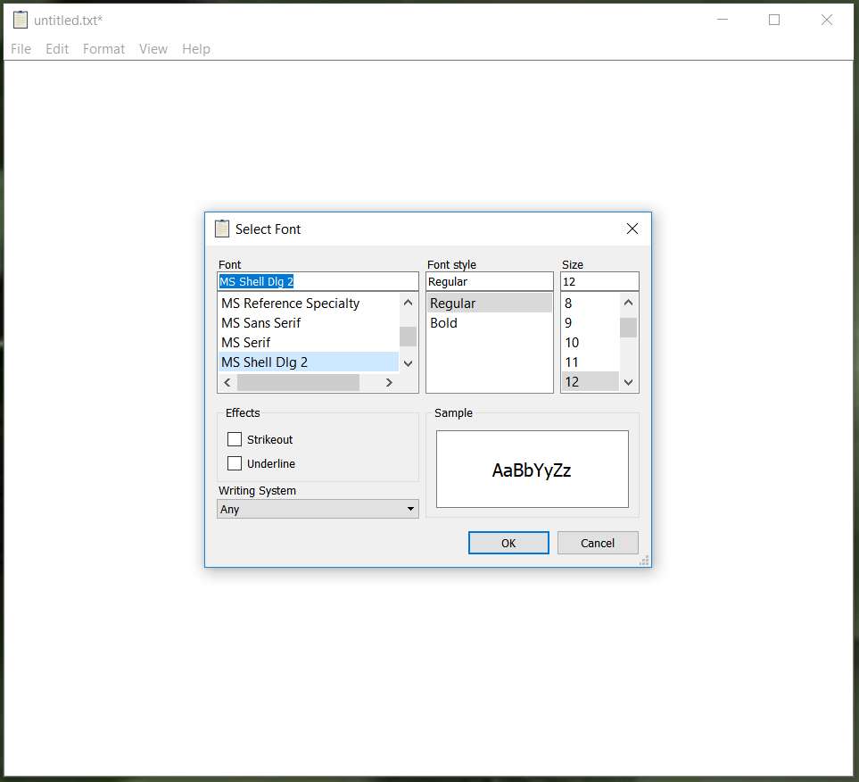

# Notepad--
A lightweight and cross platform variant of notepad

## Features
   * Written in uncomplicated c++
   * supports all operations on notepad and adds extra features
   * crossplatform
   
## Demo

## Contributing
Pull requests are welcome. For major changes, please open an issue first to discuss what you would like to change.

## References
* Notepad
    https://en.wikipedia.org/wiki/Microsoft_Notepad

### Todos

 - Complete Features for searching and printing
 - Write tests
 - Add more shortcuts
 - Add intellisense

License
----

MIT &copy; Kumbong Hermann
